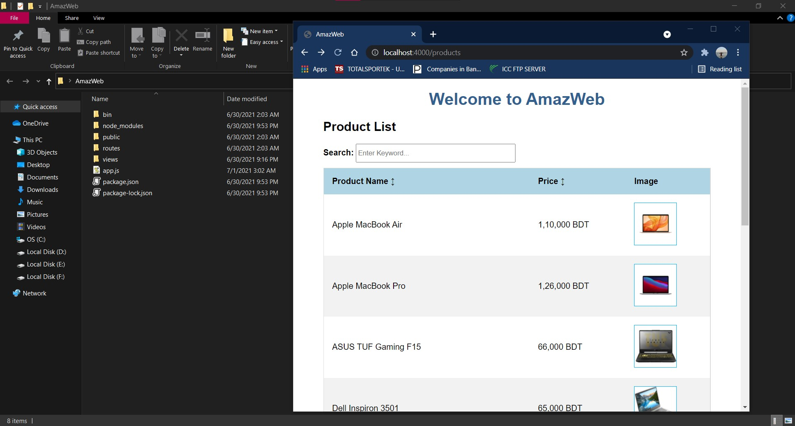
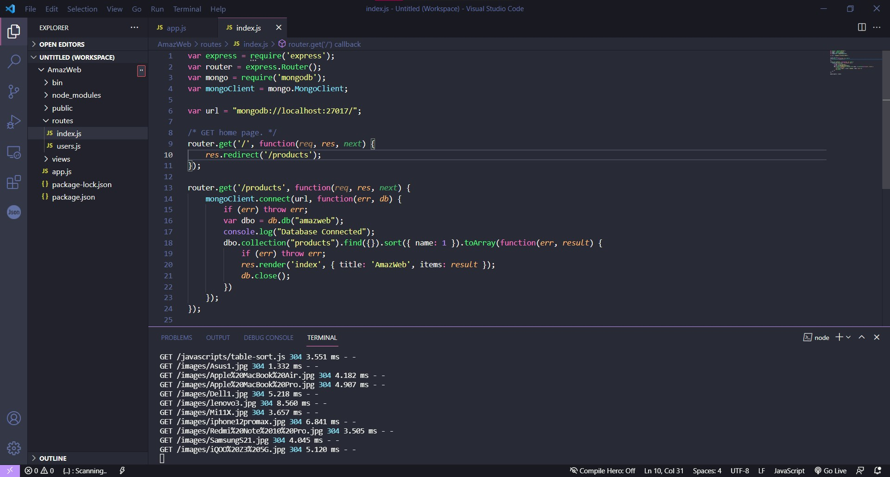
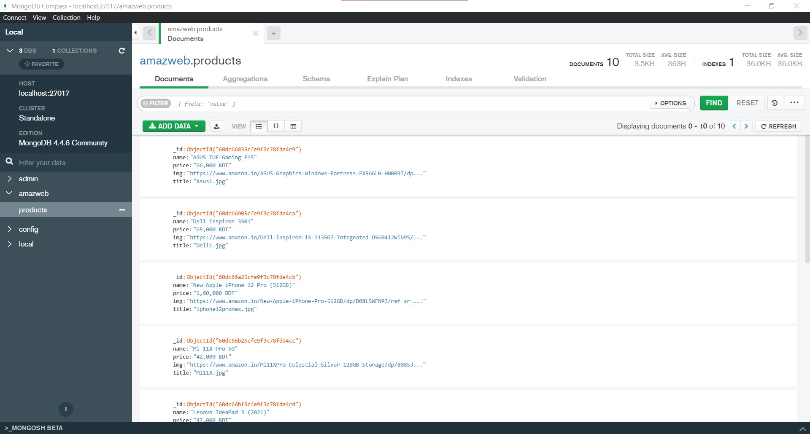
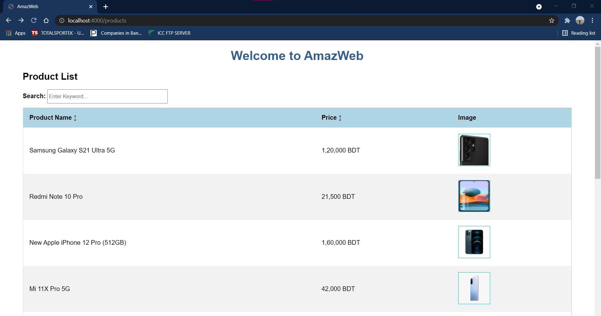
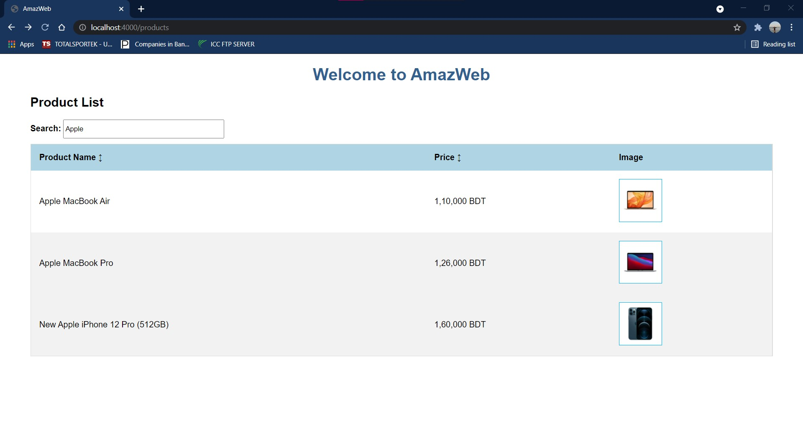
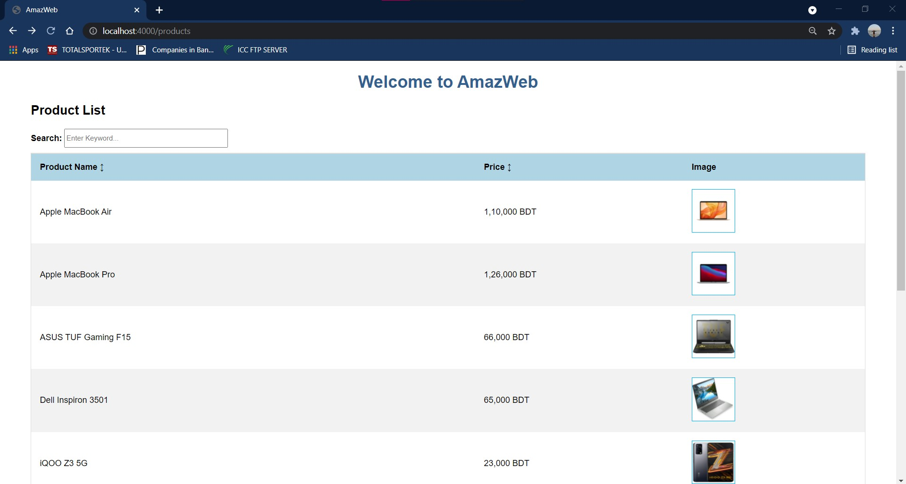
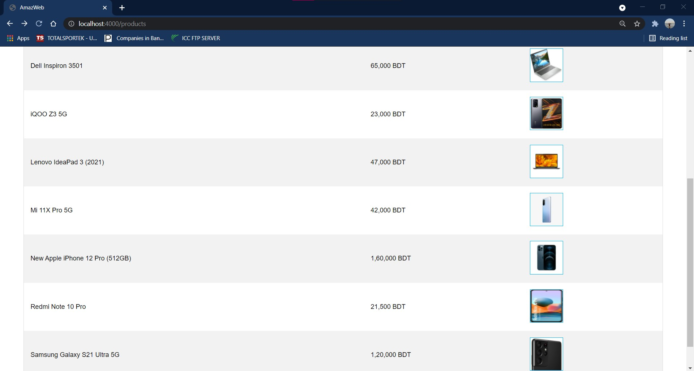
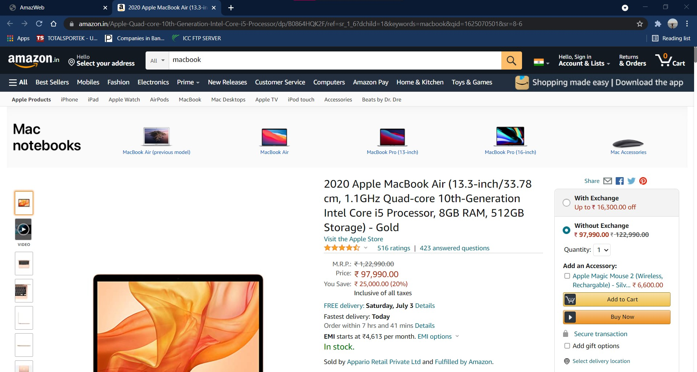

# AmazWeb

A mini website which is built with JavaScript( NodeJS Environment ). ExpressJS framework and MongoDB database are used to build this application.

1. Responsive UI
2. Framework (ExpressJS)
3. Dependency Management
4. Database (MongoDB)
5. Object Relation Mapping
6. Sortability
7. Searchability
8. A suitable look for the use case

# Responsive UI

# ExpressJS Framework

# MongoDB Database

# Sortablity

# Searchabilty

# Suitable look for the use case

# Click on image takes it to Amazon website

